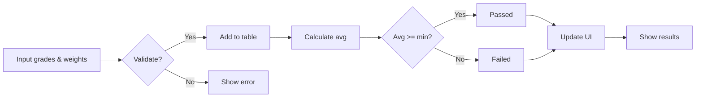

# Notes360

**Notes360** is a smart, scalable, and responsive platform designed to revolutionize grade management for schools, universities, and online courses. It automates weighted grade calculations, supports custom grading criteria, and generates detailed performance reports, streamlining academic management and enhancing student progress tracking.

---

## 🚀 Why Choose Notes360?

- **Highly scalable:** Supports thousands of simultaneous users and processes millions of grade records with high performance.
- **Responsive interface:** Works flawlessly on desktops, tablets, and mobile devices.
- **Intelligent automation:** Eliminates human error by automating weighted average calculations and pass/fail evaluations.
- **User-friendly experience:** Designed for intuitive use, minimizing the time spent managing academic data.
- **Flexible grading systems:** Supports customizable weightings and passing criteria tailored to your institution’s needs.

---

## 🛠 Technology Stack

| Layer          | Technology / Tool       | Purpose                                         |
|----------------|------------------------|------------------------------------------------|
| Frontend       | HTML5, CSS3, JavaScript| Building UI, styling, and client-side logic    |
| UI/UX Design   | Figma                  | Prototyping and visual design                   |
| Version Control| Git & GitHub           | Source code management                           |
| State Management | Vanilla JavaScript    | Dynamic data handling and DOM manipulation      |

---

## 🔍 Technical Highlights

- **Semantic HTML:** Proper use of HTML tables for clear and accessible grade display.
- **Modern CSS:** Clean, responsive styling to ensure accessibility and polished visuals.
- **Modular JavaScript:** Reusable functions for maintainable and scalable logic implementation.
- **Input Validation:** Real-time user input validation to ensure data integrity.
- **Dynamic DOM Updates:** Add and update grade entries without page reloads.
- **Automated Pass/Fail Logic:** Automatically determine passing status based on configurable minimum grade.

---

## 📊 How the Grade Calculator Works (JavaScript Flow)


## Figma
<p align="center">
  
</p>

<p align="center">
  <strong>Design and Prototyping:</strong><br>
  Experienced in creating intuitive and detailed UI/UX prototypes using Figma, enabling seamless project planning and stakeholder communication.
</p>

## 🧑‍💻 Skills Demonstrated and Applied
```
Dynamic creation of HTML grade tables with semantic markup.

Application of modern CSS for responsive and accessible styling.

Development of modular JavaScript logic, including:

Reusable functions for weighted grade calculations.

Conditional logic for pass/fail determination.

Efficient DOM manipulation for smooth, real-time updates.

Robust input handling and validation to prevent errors.

Integration of UI/UX prototypes from Figma for visual and functional alignment.
```
---

## ⚡ Getting Started
Clone this repository.

Open index.html in your preferred browser.

Add your activities and grades, and watch Notes360 streamline your academic management with intelligent automation.

## 🌟 Transform Your Academic Management with Notes360!
Accelerate workflows, eliminate manual errors, and provide students and educators with a modern, easy-to-use tool that makes tracking academic performance effortless.
